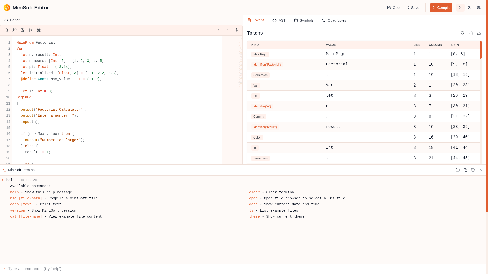
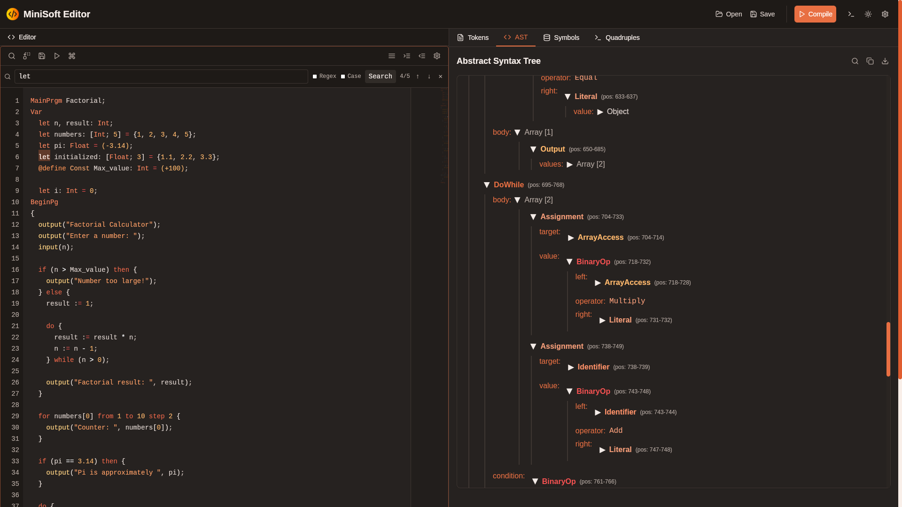
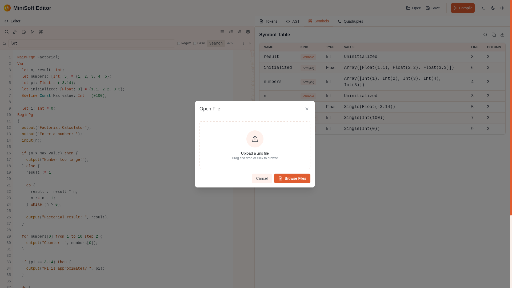
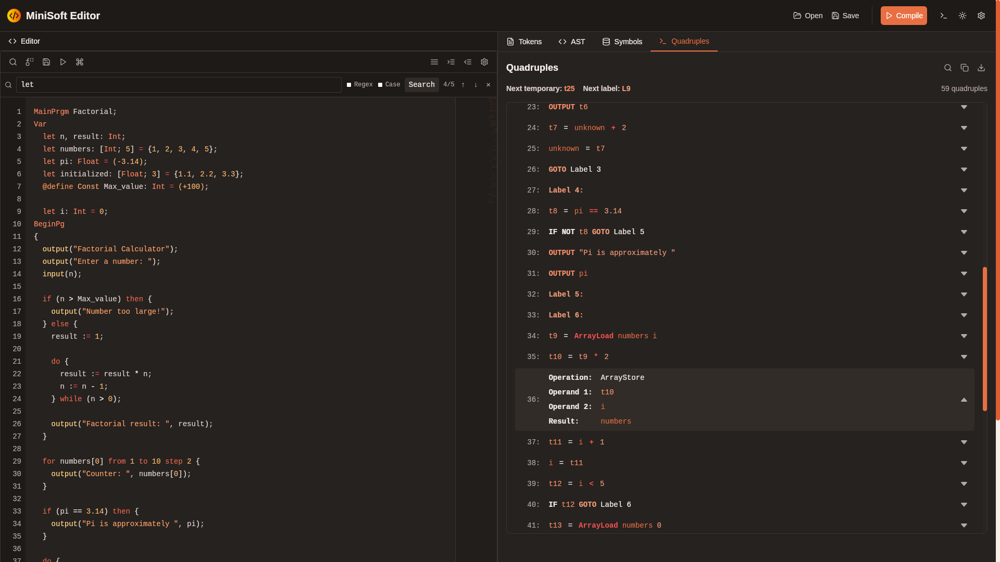

# MiniSoft Language Desktop Editor

A desktop application for editing, analyzing, and compiling MiniSoft language programs. This editor provides an intuitive interface for writing MiniSoft code, visualizing its structure, and understanding its compilation process. Built with [Tauri](https://tauri.app/) for the desktop application framework, a Rust backend for compilation, and a [Next.js](https://nextjs.org/) frontend for the user interface.

## Features

This editor is designed to enhance the MiniSoft programming experience by providing the following features:

### Editor Features

- Syntax highlighting for MiniSoft language.
- Multiple editor shortcuts.
- Error highlighting for lexical errors.

### Compiler Integration

- Tokenization: Displays the list of tokens generated by the lexer.
- Abstract Syntax Tree (AST): Visualizes the parsed structure of the program.
- Symbol Table: Shows the symbol table with variable declarations, types, and positions.
- Quadruples: Displays the intermediate representation used for code generation.

### Additional Features

- File management: Open, save, and manage MiniSoft source files.
- Integrated terminal: Run the compiled MiniSoft programs directly from the editor (under development).
- Cross-platform support: Runs on Linux, macOS, and Windows.

## Screenshots

### Tokens View (Light Theme)



### AST View (Dark Theme)



### Symbols View (Light Theme)



### Quadruple View (Dark Theme)



## Project Structure

```
minisoft-editor/
├── README.md
├── LICENSE                   # MIT License
├── next-env.d.ts             # Next.js type definitions
├── index.html                # HTML entry point
├── src-tauri/                # Tauri backend
│   ├── Cargo.toml
│   └── src/                  # Backend source code
├── minisoft-compiler/        # MiniSoft compiler library
│   ├── Cargo.toml
│   ├── README.md
│   ├── src/                  # Compiler implementation
│   │   ├── lexer/            # Lexical analysis
│   │   │   ├── mod.rs        # Lexer module exports
│   │   │   ├── token.rs      # Token definitions
│   │   │   └── lexer.rs      # Logos lexer implementation
│   │   ├── parser/           # Syntax analysis
│   │   │   ├── mod.rs        # Parser module exports
│   │   │   ├── ast.rs        # Abstract Syntax Tree definitions
│   │   │   ├── grammar.lalrpop # LALRPOP grammar definition
│   │   │   └── error.rs      # Parser error handling
│   │   ├── semantics/        # Semantic analysis
│   │   │   ├── mod.rs        # Semantics module exports
│   │   │   ├── analyzer.rs   # Semantic analyzer main implementation
│   │   │   ├── symbol_table.rs # Symbol table implementation
│   │   │   └── error.rs      # Semantic error handling
│   │   ├── codegen/          # Code generation
│   │   │   ├── mod.rs        # Code generation module exports
│   │   │   └── quadruple.rs  # Quadruple intermediate representation
│   │   └── error_reporter/   # Error handling & reporting
│   └── tests/                # Compiler test suite
├── src/                      # Frontend source code
│   ├── app/                  # Next.js app directory
│   │   ├── layout.tsx        # Root layout component
│   │   └── page.tsx          # Main application page
│   ├── components/           # Shared UI components
│   │   ├── ErrorReporter.tsx # Error display component
│   │   └── FileModal.tsx     # File management modal
│   ├── features/             # Feature modules
│   │   ├── editor/           # Code editor feature
│   │   │   ├── CodeEditor.tsx          # Main editor component
│   │   │   ├── components/             # Editor UI components
│   │   │   ├── hooks/                  # Editor-specific hooks
│   │   │   └── styles/                 # Editor styling
│   │   ├── results/          # Results visualization feature
│   │   │   ├── ResultPanel.tsx         # Main results panel
│   │   │   ├── components/             # Result view components
│   │   │   │   ├── ASTViewer.tsx       # AST visualization
│   │   │   │   ├── SymbolsViewer.tsx   # Symbol table display
│   │   │   │   └── CollapsibleSection.tsx # UI helper component
│   │   │   └── utils/                  # Result formatting utilities
│   │   ├── settings/         # Settings feature
│   │   │   └── SettingsModal.tsx       # Settings dialog component
│   │   └── terminal/         # Terminal feature
│   │       ├── Terminal.tsx            # Main terminal component
│   │       ├── components/             # Terminal UI components
│   │       ├── constants/              # Example files & commands
│   │       ├── types/                  # Terminal type definitions
│   │       └── utils/                  # File system utilities
│   ├── styles/               # Global styles
│   │   └── globals.css       # Global CSS styles
│   ├── types/                # Type definitions
│   │   ├── index.ts          # Type exports
│   │   ├── ast.ts            # AST type definitions
│   │   ├── common.ts         # Common type definitions
│   │   ├── compiler.ts       # Compiler-related types
│   │   ├── errors.ts         # Error type definitions
│   │   └── quadruple.ts      # Intermediate representation types
│   └── utils/                # Shared utilities
│       └── theme.ts          # Theme utility functions
├── public/                   # Static assets
│   └── minisoft-icon.ico     # Application icon
└── screenshots/              # Documentation screenshots
```

## Installation

### Prerequisites

- [Rust](https://www.rust-lang.org/tools/install) (for Tauri backend)
- [Node.js](https://nodejs.org/) (for Next.js frontend)
- [pnpm](https://pnpm.io/) (package manager for frontend)

### Steps

1. Clone the repository:

   ```bash
   git clone https://github.com/Adel2411/minisoft-editor.git
   cd minisoft-editor
   ```

2. Install frontend dependencies:

   ```bash
   pnpm install
   ```

3. Run the application:
   ```bash
   pnpm tauri dev
   ```

## Usage

1. Launch the application using the above steps.
2. Open or create a MiniSoft source file in the editor.
3. Use the results display to:
   - View tokens generated by the lexer.
   - Visualize the Abstract Syntax Tree (AST).
   - Inspect the symbol table.
   - Analyze the quadruple intermediate representation.
4. Compile and run the program using the integrated terminal.

## Development

### Backend Development

The backend is implemented in Rust and uses the MiniSoft compiler to process the source code. To add or modify backend functionality:

> **Note:** The compiler code in `minisoft-compiler/` is based on the [rust-compiler](https://github.com/Noussour/rust-compiler) repository, created by [Rach17](https://github.com/Rach17) and [Adel2411](https://github.com/Adel2411)

1. Edit the Rust files in the `minisoft-compiler/src/` directory.
2. Update the Tauri commands in `src-tauri/src/lib.rs` to expose functionality to the frontend.

### Frontend Development

The frontend is built with Next.js and React. To modify the user interface:

1. Edit the React components in the `src/components/` directory.
2. Modify the main page in `src/app/page.tsx`.

### Running Tests

- Run compiler tests:
  ```bash
  cd minisoft-compiler
  cargo test
  ```
- Run the full application:
  ```bash
  pnpm tauri dev
  ```

## Contributing

Contributions are welcome! Please follow these steps:

1. Fork the repository.
2. Create a new branch for your feature or bug fix.
3. Submit a pull request with a detailed description of your changes.

## License

This project is licensed under the MIT License. See the [LICENSE](LICENSE) file for details.

## Acknowledgments

- [Tauri](https://tauri.app/) for the desktop application framework.